# FleetWisor Android App

FleetWisor is a mobile application designed for managing private vehicle fleets. It provides
functionality for vehicle tracking, maintenance management, driver profiles, trip monitoring, and
fuel expense tracking.

## 📱 Technologies Used

- **Kotlin** – Main programming language
- **Jetpack Compose** – Modern UI toolkit
- **MVVM** – Architecture pattern
- **Koin** – Dependency injection
- **Navigation Compose** – App navigation
- **DataStore** – local preferences
- **Ktor Client** – API communication

## 📁 Project Structure

```
.
├── app/                     # Single application module
│   └── features/            # features package
│       ├── auth/            # Authorization screens and logic
│       ├── drivers/         # Driver management features
│       ├── cars/            # Vehicle management features
│       ├── profile/         # User profile and settings
│       └── mainmenu/        # Main dashboard
│   ├── core/                # Networking, ui, theme, utilities
│   ├── app/                 # app level
│   └──build.gradle.kts     # App-level Gradle config
├── build.gradle.kts         # Root Gradle config
├── settings.gradle.kts
├── .env.local               # Environment variables (not committed)
└── README.md
```

## 🖼️ Screenshots

### Main Screen

<p float="left">
    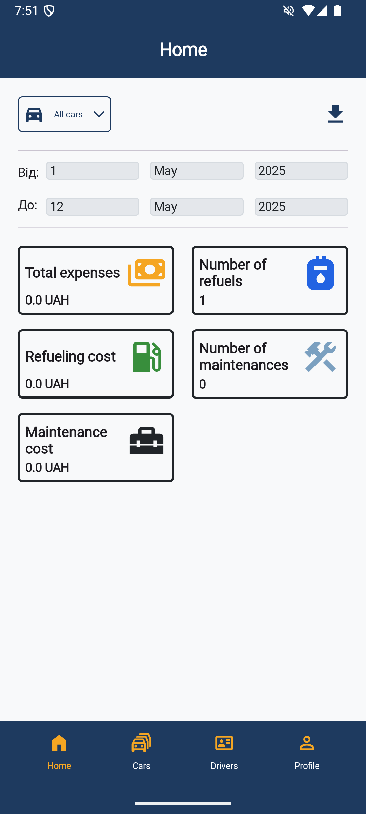
    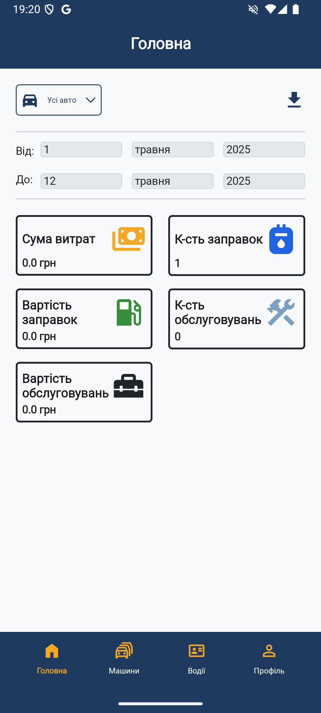
</p>

### Car Screen

#### Main menu

<p float="left">
    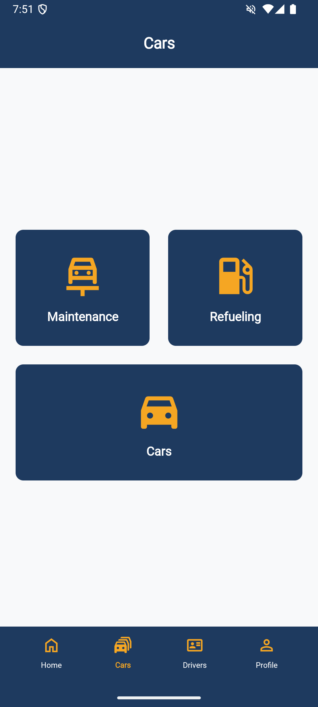
    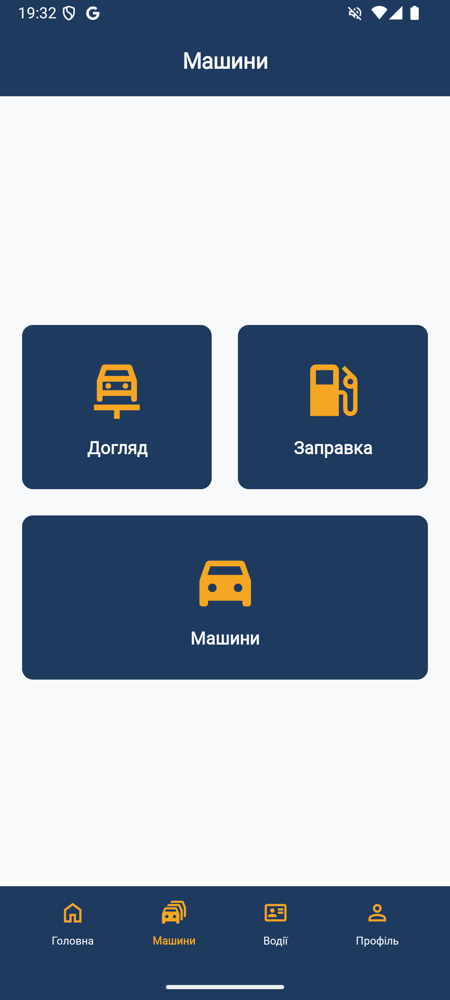
</p>

#### Cars list

<p float="left">
    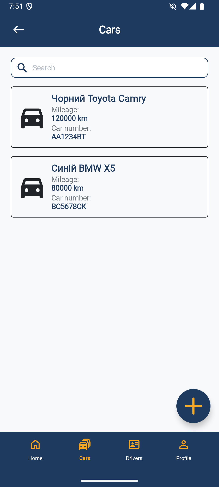
    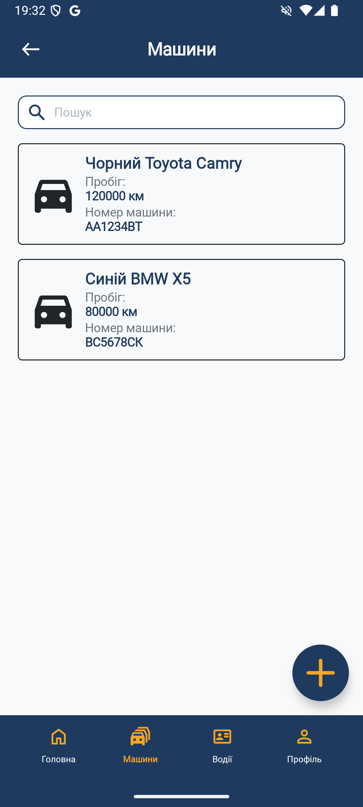
</p>

#### Car detailed

<p float="left">
    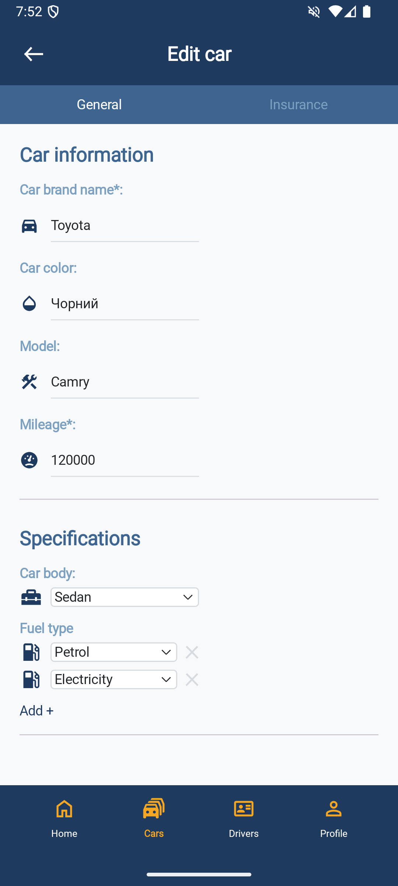
    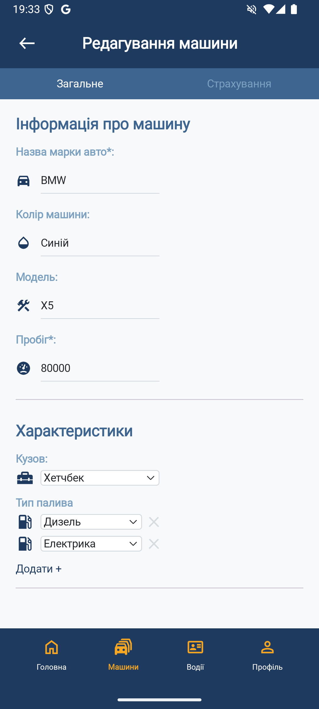
</p>

<p float="left">
    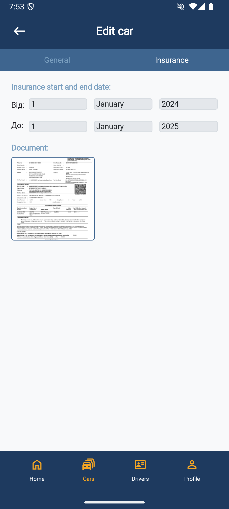
    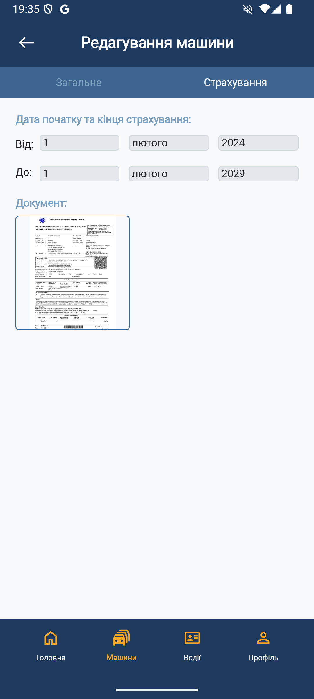
</p>

### Driver Screen

#### Drivers list

<p float="left">
    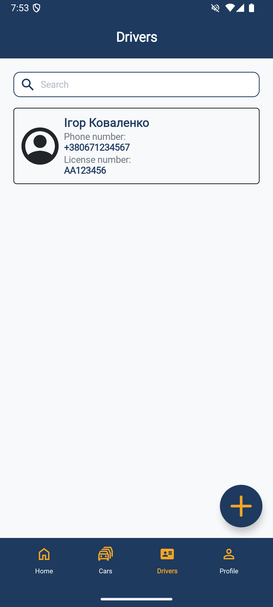
    
</p>

#### Driver detailed

<p float="left">
    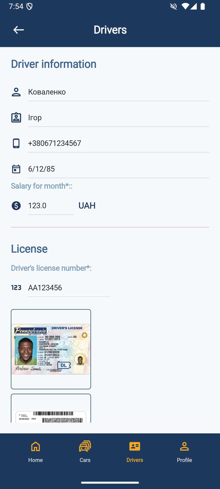
    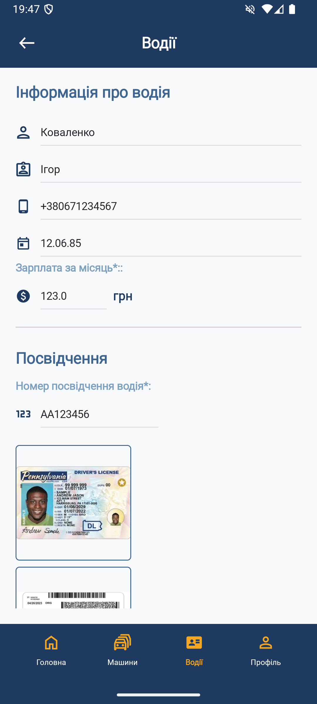
</p>

### Profile

<p float="left">
    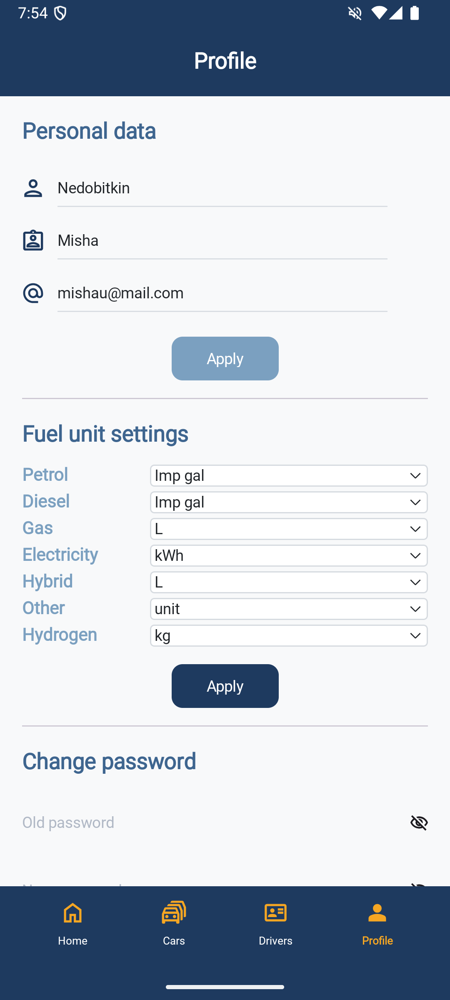
    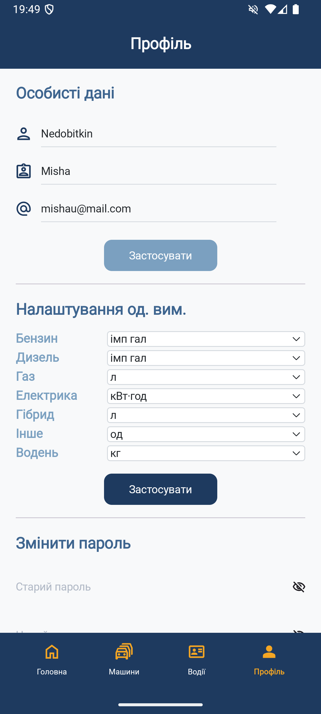
</p>

## 🚀 Getting Started

### Prerequisites

- Android Studio Hedgehog or later
- Android SDK 29 or above
- JDK 17+

### Setup

1. Clone the repository:
    ```bash
    git clone https://github.com/your-username/fleetwisor-android.git
    cd fleetwisor-android
    ```

2. Create `.env.local` in the root directory and configure:

    ```
    sdk.dir=<your-sdk-path>
    URL=https://api.example.com
    DEV_URL=http://10.0.2.2:8080
    ```

3. Open the project in Android Studio and sync Gradle.

### Running the App

- Connect an emulator or device.
- Run the `:app` module via Android Studio or CLI:
  ```bash
  ./gradlew installDebug
  ```

## 🌐 Environments

- `URL` – Production API endpoint.
- `DEV_URL` – Local development backend address.

